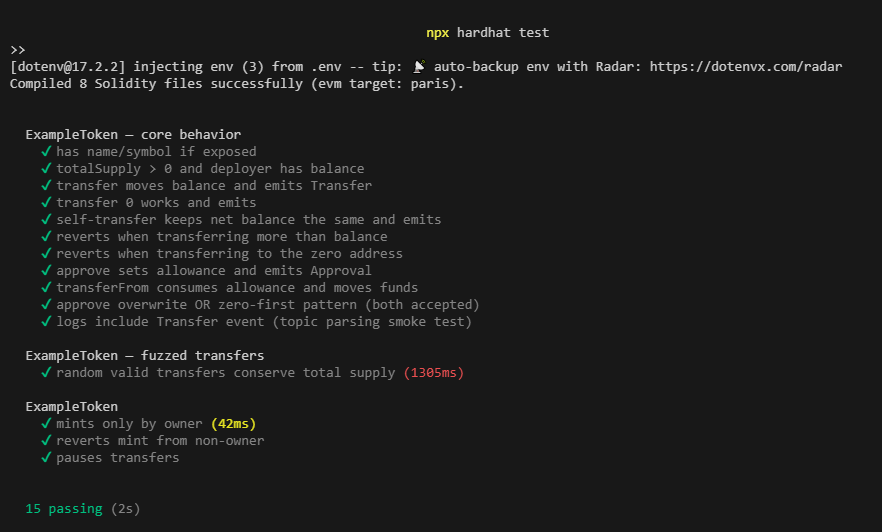

# 🧪 todor-stavrev-qa-blockchain-tests

<div align="center">

[](https://tosheto.github.io/todor-stavrev-qa-blockchain-tests/)


[](https://github.com/tosheto/todor-stavrev-qa-blockchain-tests/actions/workflows/coverage.yml)


</div>

> [!IMPORTANT]
> **▶ Live Test Report:** → https://tosheto.github.io/todor-stavrev-qa-blockchain-tests/

Smart contract QA project using **Hardhat**, **TypeScript**, **Chai** and **TypeChain** for automated and manual testing.  
Includes a sample **ERC20 smart contract**, deployment script, and unit tests with gas usage metrics.

---
## 📸 Screenshots

### ✅ Passing tests


### 📊 Gas usage report


## 🚀 Features
- Hardhat setup with TypeScript support  
- Sample ERC20 contract (`ExampleToken.sol`)  
- Unit tests with Chai + Hardhat Chai Matchers  
- Type-safe contract interactions via TypeChain  
- Gas usage and deployment cost reporting  
- Ready for CI/CD and GitHub Actions integration  

---

## 📂 Project Structure
- `contracts/` → Solidity smart contracts  
- `scripts/` → Deployment scripts  
- `test/` → Automated tests in TypeScript  
- `typechain-types/` → Auto-generated TypeChain typings  
- `hardhat.config.ts` → Hardhat configuration  

---

## ⚡ Getting Started

1. **Install dependencies**
   ```bash
   npm install

2. **Compile Contracts** 
    ```bash
    npx hardhat compile

3. **Run Tests** 
    ```bash
    npm test
4. **Deploy Locally (Hardhat network)** 
    ```bash
    npx hardhat run scripts/deploy.ts

## 🚀 Tech Stack
-  Solidity (v0.8.20)
-  Hardhat (with toolbox)
-  TypeScript
-  Chai + Hardhat Chai Matchers
-  TypeChain (ethers v6 bindings)

## 📂 License
-  This project is licensed under the MIT License.
